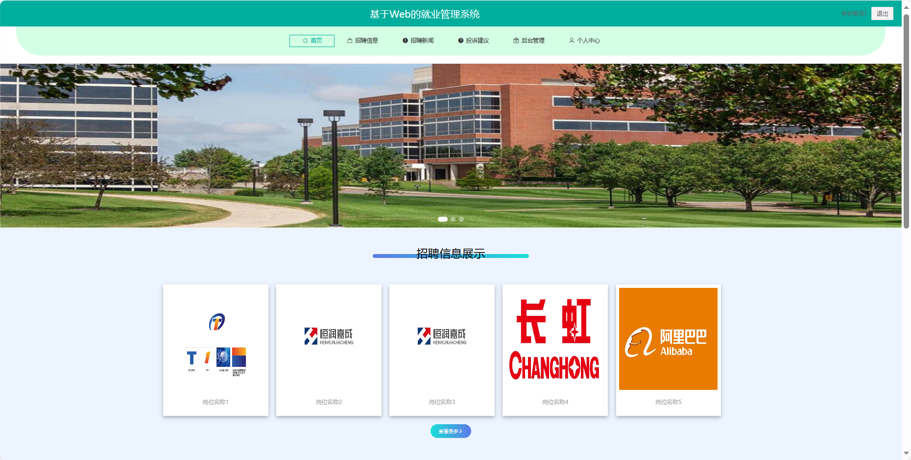
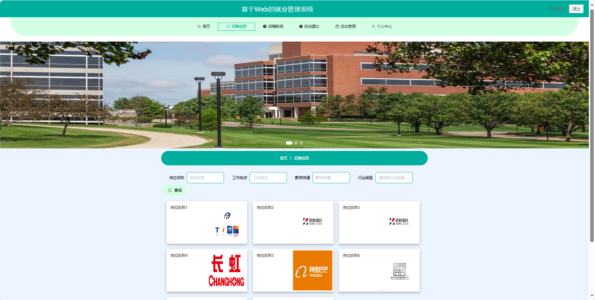
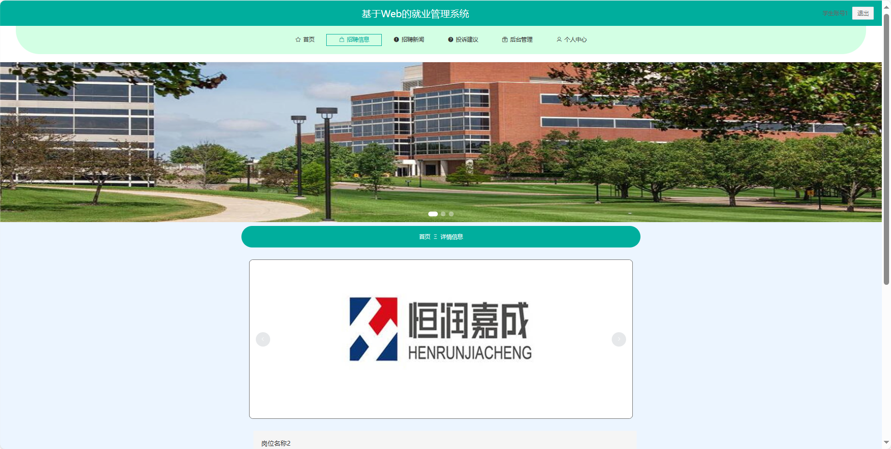
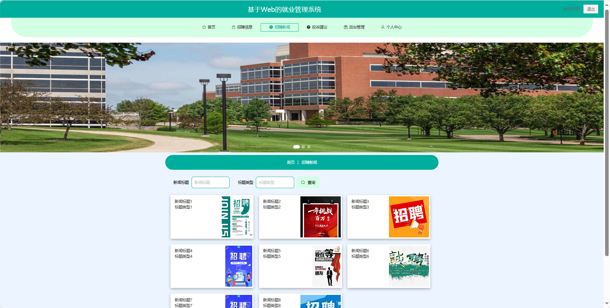
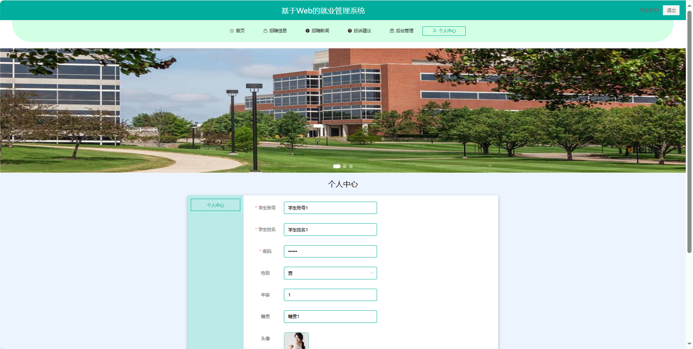
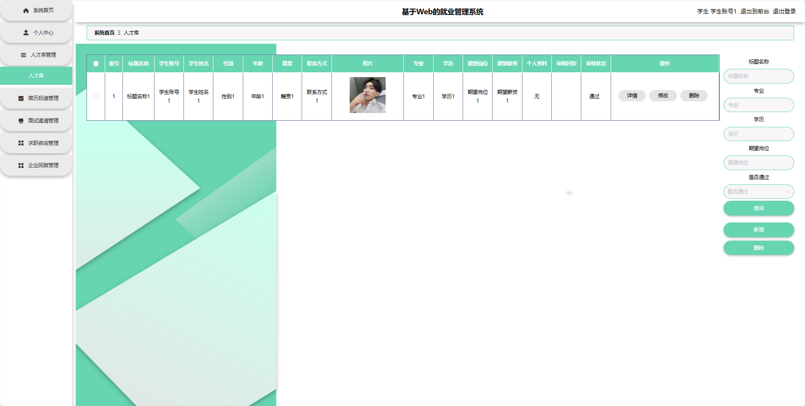
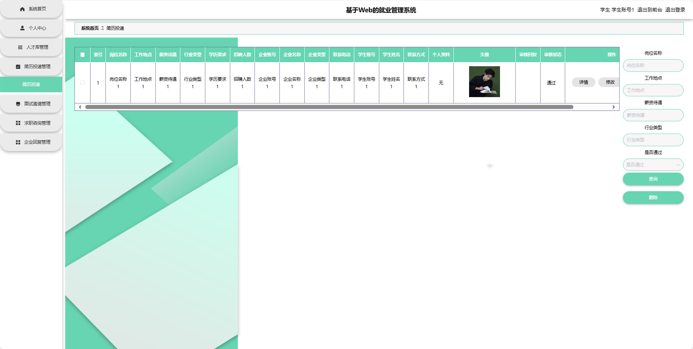
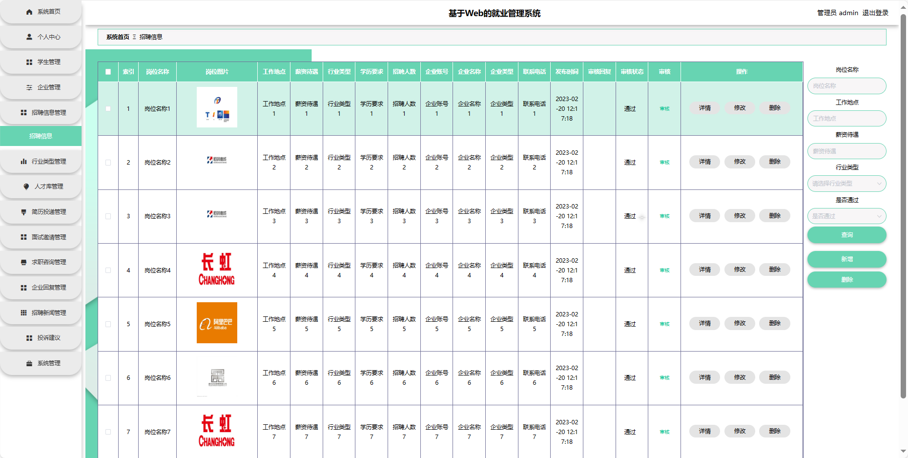

## 基于SpringBoot的就业管理系统

###  获取sql数据库文件: 从戎源码网 (https://armycodes.com/) QQ: 386869957 QQ群: 377586148
###  所有系统地址: (https://github.com/YuLin-Coder/AllProjectCatalog) 
###  所有项目以及源代码本人均调试运行无问题 可支持远程安装部署调试、定制修改、代码讲解

## 项目介绍
基于SpringBoot的就业管理系统，系统包含三种角色：管理员、用户,企业主要功能如下。

### 【管理员】:
系统首页：查看系统整体。
个人中心：管理个人信息。
学生管理：审核和管理注册学生用户的信息。
企业管理：审核和管理注册企业用户的信息。
招聘信息管理：监管和管理企业发布的招聘信息。
行业类型管理：管理系统中的行业分类信息。
人才库管理：查看和管理系统中的学生人才信息。
简历投递管理：处理学生投递的简历，包括审核、邀请等。
面试邀请管理：管理企业对学生的面试邀请。
求职咨询管理：处理用户对招聘的咨询和问题。
企业回复管理：管理企业对用户咨询的回复。
招聘新闻管理：发布、编辑和删除招聘相关的新闻和资讯。
投诉建议：查看和处理用户的投诉和建议。
系统管理：管理系统的基本设置和运行参数。

### 【企业功能】
系统首页：查看系统的信息。
个人中心：管理企业信息、查看招聘历史记录等。
招聘信息管理：发布、编辑和管理企业的招聘信息。
人才库管理：查看系统中的学生人才信息。
简历投递管理：查看和处理学生对招聘的简历投递。
面试邀请管理：发送和管理对学生的面试邀请。
求职咨询管理：接收和回复用户对招聘的咨询。
企业回复管理：管理企业对用户咨询的回复。
招聘新闻管理：发布、编辑和删除企业相关的招聘新闻。

### 【用户】:
首页：查看系统的信息。
招聘信息：浏览企业发布的招聘信息。
招聘新闻：浏览与招聘相关的新闻和资讯。
投诉建议：提供对系统或招聘服务的投诉和建议。
后台管理：进行系统首页、个人中心、人才库管理、简历投递管理、面试邀请管理、求职咨询管理、企业回复管理等操作。
个人中心：管理个人信息、查看招聘历史记录等。

## 项目技术
- 编程语言：Java
- 数据库：MySQL
- 项目管理工具：Maven
- 前端技术：HTML、CSS、JavaScript、Jquery、Vue
- 后端技术：Spring、SpringMVC、MyBatis

## 运行环境
- JDK版本：JDK1.8及以上
- 开发工具：IDEA、Ecplise、Myecplise都可以
- 数据库: MySQL5.7及以上
- Maven：maven3.0及以上
- Node：14.14.0及以上

## 运行截图

